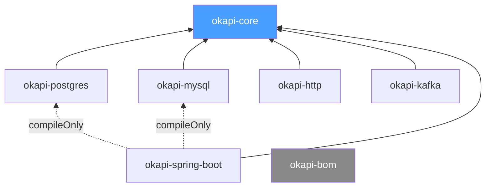

# Okapi

[](https://softwaremill.community/c/open-source/11)
[](https://github.com/softwaremill/okapi/actions?query=workflow%3A%22CI%22)
[](LICENSE)

Kotlin library implementing the **transactional outbox pattern** — reliable message delivery alongside local database operations.

Messages are stored in a database table within the same transaction as your business operation, then asynchronously delivered to external transports (HTTP webhooks, Kafka). This guarantees **at-least-once delivery** without distributed transactions.

## Quick Start (Spring Boot)

Add dependencies using the BOM for version alignment:

```kotlin
dependencies {
    implementation(platform("com.softwaremill.okapi:okapi-bom:$okapiVersion"))
    implementation("com.softwaremill.okapi:okapi-core")
    implementation("com.softwaremill.okapi:okapi-postgres")
    implementation("com.softwaremill.okapi:okapi-http")
    implementation("com.softwaremill.okapi:okapi-spring-boot")
}
```

Provide a `MessageDeliverer` bean — this tells okapi how to deliver messages:

```kotlin
@Bean
fun httpDeliverer(): HttpMessageDeliverer =
    HttpMessageDeliverer(ServiceUrlResolver { "https://my-service.example.com" })
```

Publish inside any `@Transactional` method — inject `SpringOutboxPublisher` via constructor:

```kotlin
@Service
class OrderService(
    private val orderRepository: OrderRepository,
    private val springOutboxPublisher: SpringOutboxPublisher
) {
    @Transactional
    fun placeOrder(order: Order) {
        orderRepository.save(order)
        springOutboxPublisher.publish(
            OutboxMessage("order.created", order.toJson()),
            httpDeliveryInfo {
                serviceName = "notification-service"
                endpointPath = "/webhooks/orders"
            }
        )
    }
}
```

Autoconfiguration handles scheduling, retries, and delivery automatically.

> **Note:** `okapi-postgres` requires Exposed ORM dependencies in your project.
> Spring and Kafka versions are not forced by okapi — you control them.

## How It Works

Okapi implements the [transactional outbox pattern](https://softwaremill.com/microservices-101/) (see also: [microservices.io description](https://microservices.io/patterns/data/transactional-outbox.html)):

1. Your application writes an `OutboxMessage` to the outbox table **in the same database transaction** as your business operation
2. A background `OutboxScheduler` polls for pending messages and delivers them to the configured transport (HTTP, Kafka)
3. Failed deliveries are retried according to a configurable `RetryPolicy` (max attempts, backoff)

**Delivery guarantees:**

- **At-least-once delivery** — okapi guarantees every message will be delivered, but duplicates are possible (e.g., after a crash between delivery and status update). Consumers should handle idempotency, for example by checking the `OutboxId` returned by `publish()`.
- **Concurrent processing** — multiple processors can run in parallel using `FOR UPDATE SKIP LOCKED`, so messages are never processed twice simultaneously.
- **Delivery result classification** — each transport classifies errors as `Success`, `RetriableFailure`, or `PermanentFailure`. For example, HTTP 429 is retriable while HTTP 400 is permanent.

## Modules



| Module | Purpose |
|--------|---------|
| `okapi-core` | Transport/storage-agnostic orchestration, scheduling, retry policy |
| `okapi-postgres` | PostgreSQL storage via Exposed ORM (`FOR UPDATE SKIP LOCKED`) |
| `okapi-mysql` | MySQL 8+ storage via Exposed ORM |
| `okapi-http` | HTTP webhook delivery (JDK HttpClient) |
| `okapi-kafka` | Kafka topic publishing |
| `okapi-spring-boot` | Spring Boot autoconfiguration (auto-detects store and transports) |
| `okapi-bom` | Bill of Materials for version alignment |

## Compatibility

| Dependency | Supported Versions | Notes |
|---|---|---|
| Java | 21+ | Required |
| Spring Boot | 3.5.x, 4.0.x | `okapi-spring-boot` module |
| Kafka Clients | 3.9.x, 4.x | `okapi-kafka` — you provide `kafka-clients` |
| Exposed | 1.x | `okapi-postgres`, `okapi-mysql` — you provide Exposed |

## Build

```sh
./gradlew build          # Build all modules
./gradlew test           # Run tests (Docker required — Testcontainers)
./gradlew ktlintFormat   # Format code
```

Requires JDK 21.

## Contributing

All suggestions welcome :)

To compile and test, run:

```sh
./gradlew build
./gradlew ktlintFormat   # Mandatory before committing
```

See the list of [issues](https://github.com/softwaremill/okapi/issues) and pick one! Or report your own.

If you are having doubts on the _why_ or _how_ something works, don't hesitate to ask a question on [Discourse](https://softwaremill.community/c/open-source/11) or via GitHub. This probably means that the documentation or code is unclear and can be improved for the benefit of all.

Tests use [Testcontainers](https://www.testcontainers.org/) — Docker must be running.

When you have a PR ready, take a look at our ["How to prepare a good PR" guide](https://softwaremill.community/t/how-to-prepare-a-good-pr-to-a-library/448). Thanks! :)

## Project sponsor

We offer commercial development services. [Contact us](https://softwaremill.com) to learn more about us!

## Copyright

Copyright (C) 2026 SoftwareMill [https://softwaremill.com](https://softwaremill.com).
