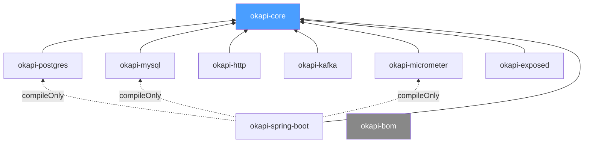

# Okapi

[](https://softwaremill.community/c/open-source/11)
[](https://github.com/softwaremill/okapi/actions?query=workflow%3A%22CI%22)
[](https://kotlinlang.org)
[](https://www.java.com)
[](LICENSE)

Kotlin library implementing the **transactional outbox pattern** — reliable message delivery alongside local database operations.

Messages are stored in a database table within the same transaction as your business operation, then asynchronously delivered to external transports (HTTP webhooks, Kafka). This guarantees **at-least-once delivery** without distributed transactions.

## Quick Start (Spring Boot)

Add dependencies using the BOM for version alignment:

```kotlin
dependencies {
    implementation(platform("com.softwaremill.okapi:okapi-bom:$okapiVersion"))
    implementation("com.softwaremill.okapi:okapi-core")
    implementation("com.softwaremill.okapi:okapi-postgres")
    implementation("com.softwaremill.okapi:okapi-http")
    implementation("com.softwaremill.okapi:okapi-spring-boot")
}
```

Provide a `MessageDeliverer` bean — this tells okapi how to deliver messages.
`ServiceUrlResolver` maps the logical service name (set per message) to a base URL:

```kotlin
@Bean
fun httpDeliverer(): HttpMessageDeliverer =
    HttpMessageDeliverer(ServiceUrlResolver { serviceName ->
        when (serviceName) {
            "notification-service" -> "https://notifications.example.com"
            else -> error("Unknown service: $serviceName")
        }
    })
```

Publish inside any `@Transactional` method — inject `SpringOutboxPublisher` via constructor:

```kotlin
@Service
class OrderService(
    private val orderRepository: OrderRepository,
    private val springOutboxPublisher: SpringOutboxPublisher
) {
    @Transactional
    fun placeOrder(order: Order) {
        orderRepository.save(order)
        springOutboxPublisher.publish(
            OutboxMessage("order.created", order.toJson()),
            httpDeliveryInfo {
                serviceName = "notification-service"
                endpointPath = "/webhooks/orders"
            }
        )
    }
}
```

Autoconfiguration handles scheduling, retries, and delivery automatically. For Micrometer metrics, also add `okapi-micrometer` — see [Observability](#observability).

**Using Kafka instead of HTTP?** Swap the deliverer bean and delivery info:

```kotlin
@Bean
fun kafkaDeliverer(producer: KafkaProducer<String, String>): KafkaMessageDeliverer =
    KafkaMessageDeliverer(producer)
```
```kotlin
springOutboxPublisher.publish(
    OutboxMessage("order.created", order.toJson()),
    kafkaDeliveryInfo { topic = "order-events" }
)
```

**Using MySQL instead of PostgreSQL?** Replace `okapi-postgres` with `okapi-mysql` in your dependencies — no code changes needed.

> **Note:** Spring and Kafka versions are not forced by okapi — you control them.
> Okapi uses plain JDBC internally — it works with any `PlatformTransactionManager` (JPA, JDBC, jOOQ, Exposed, etc.).

## How It Works

Okapi implements the [transactional outbox pattern](https://softwaremill.com/microservices-101/) (see also: [microservices.io description](https://microservices.io/patterns/data/transactional-outbox.html)):

1. Your application writes an `OutboxMessage` to the outbox table **in the same database transaction** as your business operation
2. A background `OutboxScheduler` polls for pending messages and delivers them to the configured transport (HTTP, Kafka)
3. Failed deliveries are retried according to a configurable `RetryPolicy` (max attempts, backoff)

**Delivery guarantees:**

- **At-least-once delivery** — okapi guarantees every message will be delivered, but duplicates are possible (e.g., after a crash between delivery and status update). Consumers should handle idempotency, for example by checking the `OutboxId` returned by `publish()`.
- **Concurrent processing** — multiple processors can run in parallel using `FOR UPDATE SKIP LOCKED`, so messages are never processed twice simultaneously.
- **Delivery result classification** — each transport classifies errors as `Success`, `RetriableFailure`, or `PermanentFailure`. For example, HTTP 429 is retriable while HTTP 400 is permanent.

## Database migrations

Okapi ships Liquibase changelogs that create the outbox table and its indexes:

- `classpath:com/softwaremill/okapi/db/changelog.xml` — PostgreSQL (from `okapi-postgres`)
- `classpath:com/softwaremill/okapi/db/mysql/changelog.xml` — MySQL (from `okapi-mysql`)

When `okapi-spring-boot` is on the classpath, these run automatically against the configured `DataSource` on application startup. Without Spring Boot, point your own Liquibase setup at the paths above and pass an `outboxTable` change-log parameter (see below).

### Configuration

Okapi's table names are fixed under the `okapi_` prefix so its schema stays out of the way of any pre-existing tables in the host application (`outbox`, `databasechangelog`, etc.):

| Table | Purpose |
|-------|---------|
| `okapi_outbox` | Domain table holding outbox entries (created by the bundled Liquibase changesets, queried by `PostgresOutboxStore` / `MysqlOutboxStore`). |
| `okapi_databasechangelog` | Liquibase changeset history for okapi (configurable). |
| `okapi_databasechangeloglock` | Liquibase concurrency lock for okapi (configurable). |

The Liquibase tracking-table names are configurable in case the host application wants to share them with its own Liquibase setup:

| Property | Default | Description |
|----------|---------|-------------|
| `okapi.liquibase.changelog-table` | `okapi_databasechangelog` | Liquibase changeset history for okapi |
| `okapi.liquibase.changelog-lock-table` | `okapi_databasechangeloglock` | Liquibase concurrency lock for okapi |

These properties affect the autoconfigured `okapiPostgresLiquibase` / `okapiMysqlLiquibase` beans only. If you run Liquibase yourself, configure the table names there directly. The domain table name (`okapi_outbox`) is fixed.

### Upgrading from 0.2.x

Releases up to 0.2.x wrote to shared tables `databasechangelog` / `databasechangeloglock` and the domain table `outbox`. From 0.3.0 these are renamed to `okapi_*`. Two upgrade paths:

**Stay on the existing changelog tables** (simplest for the Liquibase tracking pair, zero-downtime) — opt out of the new defaults:

```yaml
okapi:
  liquibase:
    changelog-table: databasechangelog
    changelog-lock-table: databasechangeloglock
```

The domain table `outbox` cannot be opted out via configuration — see the migration steps below.

**Migrate to dedicated tables** — run before the first 0.3.0 startup (PostgreSQL syntax shown):

```sql
-- Outbox domain table: rename in place. Indexes follow the table.
ALTER TABLE outbox RENAME TO okapi_outbox;
ALTER INDEX idx_outbox_status_last_attempt RENAME TO idx_okapi_outbox_status_last_attempt;
ALTER INDEX idx_outbox_status_created_at  RENAME TO idx_okapi_outbox_status_created_at;

-- Liquibase tracking: split okapi rows into the new tables.
CREATE TABLE okapi_databasechangelog (LIKE databasechangelog INCLUDING ALL);
CREATE TABLE okapi_databasechangeloglock (LIKE databasechangeloglock INCLUDING ALL);
INSERT INTO okapi_databasechangelog
    SELECT * FROM databasechangelog WHERE filename LIKE '%com/softwaremill/okapi/%';
INSERT INTO okapi_databasechangeloglock SELECT * FROM databasechangeloglock;
DELETE FROM databasechangelog WHERE filename LIKE '%com/softwaremill/okapi/%';
```

Without one of these steps, Liquibase will see an empty changelog table on the first 0.3.0 startup and try to re-run okapi's migrations — which fails if rows already exist under the legacy `outbox` table while okapi now writes to `okapi_outbox`.

Full release history: [CHANGELOG.md](CHANGELOG.md).

## Observability

Add `okapi-micrometer` alongside `okapi-spring-boot` (from the Quick Start above) to get Micrometer metrics:

```kotlin
implementation("com.softwaremill.okapi:okapi-micrometer")
```

With Spring Boot Actuator and a Prometheus registry (`micrometer-registry-prometheus`) on the classpath, metrics are automatically exposed on `/actuator/prometheus`. They are also visible via `/actuator/metrics`.

| Metric | Type | Description |
|--------|------|-------------|
| `okapi.entries.delivered` | Counter | Successfully delivered entries |
| `okapi.entries.retry.scheduled` | Counter | Failed attempts rescheduled for retry |
| `okapi.entries.failed` | Counter | Permanently failed entries |
| `okapi.batch.duration` | Timer | Processing time per batch |
| `okapi.entries.count` | Gauge | Current entry count (tag: `status=pending\|delivered\|failed`) |
| `okapi.entries.lag.seconds` | Gauge | Age of oldest entry in seconds (tag: `status`) |

### Configuration

| Property | Default | Description |
|----------|---------|-------------|
| `okapi.metrics.refresh-interval` | `PT15S` (15s) | How often gauge metrics poll the outbox store. Each refresh runs one transaction with two queries. |

### Multi-instance deployments

Counters and timers (`okapi.entries.delivered`, `okapi.entries.retry.scheduled`, `okapi.entries.failed`, `okapi.batch.duration`) report work performed by **each instance** — aggregate with `sum`:

```promql
sum(rate(okapi_entries_delivered_total[5m]))
```

Gauges (`okapi.entries.count`, `okapi.entries.lag.seconds`) reflect the **shared outbox state** and are reported identically by every instance. Aggregate with `max by (status)`, not `sum`:

```promql
max by (status) (okapi_entries_count)
```

Polling cost per instance is `2 queries / okapi.metrics.refresh-interval` (default `2 queries / 15s`).

### Without Spring Boot

`okapi-micrometer` has no Spring dependency. Construct the beans manually and pass a `MeterRegistry`. `MicrometerOutboxMetrics` requires a `TransactionRunner` for Exposed-backed stores — see the class KDoc.

For periodic gauge refresh, use the framework-agnostic `OutboxMetricsRefresher` (single daemon thread):

```kotlin
val listener = MicrometerOutboxListener(meterRegistry)
val metrics = MicrometerOutboxMetrics(store, meterRegistry, transactionRunner)

val refresher = OutboxMetricsRefresher(metrics, Duration.ofSeconds(15))
refresher.start()
// on application shutdown:
refresher.close()
```

Or call `metrics.refresh()` from your own scheduler (Ktor coroutine, `ScheduledExecutorService`, etc.) — `refresh()` is thread-safe.

### Custom listener

Implement `OutboxProcessorListener` to react to delivery events (logging, alerting, custom metrics). `OutboxProcessor` accepts a single listener; to combine multiple, implement a composite that delegates to each.

## Modules



| Module | Purpose |
|--------|---------|
| `okapi-core` | Transport/storage-agnostic orchestration, scheduling, retry policy, `ConnectionProvider` interface |
| `okapi-exposed` | Exposed ORM integration — `ExposedConnectionProvider`, `ExposedTransactionRunner`, `ExposedTransactionContextValidator` |
| `okapi-postgres` | PostgreSQL storage via plain JDBC (`FOR UPDATE SKIP LOCKED`) |
| `okapi-mysql` | MySQL 8+ storage via plain JDBC |
| `okapi-http` | HTTP webhook delivery (JDK HttpClient) |
| `okapi-kafka` | Kafka topic publishing |
| `okapi-micrometer` | Micrometer metrics (counters, timers, gauges) |
| `okapi-spring-boot` | Spring Boot autoconfiguration (auto-detects store, transports, and metrics) |
| `okapi-bom` | Bill of Materials for version alignment |

## Compatibility

| Dependency | Supported Versions | Notes |
|---|---|---|
| Java | 21+ | Required |
| Spring Boot | 3.5.x, 4.0.x | `okapi-spring-boot` module |
| Kafka Clients | 3.9.x, 4.x | `okapi-kafka` — you provide `kafka-clients` |
| Exposed | 1.x | `okapi-exposed` module — for Ktor/standalone apps |

## Performance

Throughput baseline (single instance, sync sequential delivery, MacBook M3 Max, JDK 25 LTS, April 2026):

| Transport | batchSize=10 | batchSize=100 |
|-----------|--------------|----------------|
| Kafka (`acks=all`, localhost broker) | ~110 msg/s | ~115 msg/s |
| HTTP @ webhook latency 20 ms | ~33 msg/s | ~36 msg/s |
| HTTP @ webhook latency 100 ms | ~9 msg/s | ~9 msg/s |

These numbers reflect the current sync-sequential delivery model. Throughput is bounded by per-message round-trip time × batch size. Performance work to lift these limits (async batch delivery, multi-threaded scheduler) is tracked under the [KOJAK-14 epic](https://softwaremill.atlassian.net/browse/KOJAK-14).

Full methodology, raw JMH results, and reproduction instructions: [`benchmarks/`](benchmarks/).

## Build

```sh
./gradlew build                  # Build all modules
./gradlew test                   # Run tests (Docker required — Testcontainers)
./gradlew ktlintFormat           # Format code
./gradlew :okapi-benchmarks:jmh  # Run JMH benchmarks (~30 min, see benchmarks/README.md)
```

Requires JDK 21.

## Contributing

All suggestions welcome :)

To compile and test, run:

```sh
./gradlew build
./gradlew ktlintFormat   # Mandatory before committing
```

See the list of [issues](https://github.com/softwaremill/okapi/issues) and pick one! Or report your own.

If you are having doubts on the _why_ or _how_ something works, don't hesitate to ask a question on [Discourse](https://softwaremill.community/c/open-source/11) or via GitHub. This probably means that the documentation or code is unclear and can be improved for the benefit of all.

Tests use [Testcontainers](https://www.testcontainers.org/) — Docker must be running.

When you have a PR ready, take a look at our ["How to prepare a good PR" guide](https://softwaremill.community/t/how-to-prepare-a-good-pr-to-a-library/448). Thanks! :)

## Project sponsor

We offer commercial development services. [Contact us](https://softwaremill.com) to learn more about us!

## Copyright

Copyright (C) 2026 SoftwareMill [https://softwaremill.com](https://softwaremill.com).
