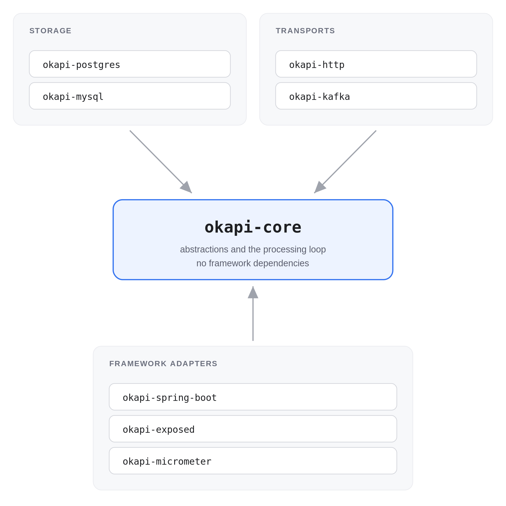

# Okapi

[](https://central.sonatype.com/artifact/com.softwaremill.okapi/okapi-core)
[](https://github.com/softwaremill/okapi/actions?query=workflow%3A%22CI%22)
[](https://kotlinlang.org)
[](https://www.java.com)
[](LICENSE)
[](https://softwaremill.community/c/open-source/11)

**Reliable message delivery for Kotlin and Java services, using the transactional outbox pattern.**

Okapi is a Kotlin/JVM library implementing the **transactional outbox pattern**. Messages are stored in the database within the same transaction as your business operation, then delivered asynchronously over HTTP or Kafka. This prevents messages from being lost between the database commit and the delivery attempt, without requiring distributed transactions.

- **Storage**: PostgreSQL, MySQL 8+
- **Transports**: HTTP webhooks, Kafka
- **Frameworks**: Spring Boot autoconfiguration, or wire it by hand anywhere on the JVM
- **Kotlin-first**, with a Java-friendly API
- **Apache-2.0**, JDK 21+

---

## Quick start (Spring Boot)

This example assumes an existing Spring Boot application connected to PostgreSQL, with a configured `DataSource` and `PlatformTransactionManager`.

**1. Add the dependencies.** The BOM keeps module versions aligned:

```kotlin
dependencies {
    implementation(platform("com.softwaremill.okapi:okapi-bom:1.0.0"))
    implementation("com.softwaremill.okapi:okapi-core")
    implementation("com.softwaremill.okapi:okapi-postgres")
    implementation("com.softwaremill.okapi:okapi-http")
    implementation("com.softwaremill.okapi:okapi-spring-boot")
    runtimeOnly("org.liquibase:liquibase-core")
}
```

Liquibase creates the `okapi_outbox` table on startup — no changelog edits on your side. See [Database schema](#database-schema).

**2. Provide a deliverer bean.** This example uses HTTP. `ServiceUrlResolver` maps a logical service name to a base URL, so deployment topology stays out of your publishing code:

```kotlin
@Bean
fun httpDeliverer(): HttpMessageDeliverer =
    HttpMessageDeliverer(ServiceUrlResolver { serviceName ->
        when (serviceName) {
            "notification-service" -> "https://notifications.example.com"
            else -> error("Unknown service: $serviceName")
        }
    })
```

**3. Publish inside your transaction.** Inject `SpringOutboxPublisher` and call it right after your business write:

```kotlin
@Service
class OrderService(
    private val orderRepository: OrderRepository,
    private val outboxPublisher: SpringOutboxPublisher,
) {
    @Transactional
    fun placeOrder(order: Order) {
        orderRepository.save(order)

        outboxPublisher.publish(
            OutboxMessage("order.created", order.toJson()),
            httpDeliveryInfo {
                serviceName = "notification-service"
                endpointPath = "/webhooks/orders"
            },
        )
    }
}
```

The order row and the outbox row now commit together or not at all. Autoconfiguration takes care of scheduling, retries, delivery and cleanup.

> `SpringOutboxPublisher` throws `IllegalStateException` if you call `publish()` outside an active read-write transaction. That is deliberate — an outbox write that can't commit atomically with your business data defeats the purpose of the pattern.

## Examples

Runnable, self-contained applications live in [okapi-examples](https://github.com/softwaremill/okapi-examples). Each one is an independent Gradle project that consumes okapi as a published dependency, with its own `docker-compose.yml` for the databases and brokers it needs.

## How it works

1. `publish()` writes a `PENDING` row to `okapi_outbox` in your transaction.
2. A background scheduler polls for pending rows (every second by default), claiming only the delivery types configured on that worker with `FOR UPDATE SKIP LOCKED` so workers do not process the same row concurrently.
3. Each row goes to the transport matching its delivery type. Success marks it `DELIVERED`; a retriable failure leaves it `PENDING` while retry attempts remain; an exhausted retry budget or permanent failure marks it `FAILED`.
4. A purger deletes delivered rows after a retention period.

### Guarantees and limits

- **Duplicate delivery is possible.** A crash between a successful delivery and the status update means the message may be sent again after restart. If processing a message more than once would cause unwanted effects, make the consumer idempotent — for example, deduplicate on a business key in the payload or a header set in the `DeliveryInfo`. okapi sends your payload and configured headers, but not the `OutboxId` returned by `publish()`; that identifier stays on the publisher side for correlation and logging.
- **Best-effort ordering.** Rows are claimed by `created_at, id` within each delivery type. The processor rotates which type it checks first between batches. Parallel delivery and retries can also change arrival order. Strict delivery ordering across types or within a type is not guaranteed.
- **Different workers can handle different delivery types.** Each worker claims only its registered types, using at most two claim queries per batch regardless of the number of types. A custom `OutboxStore` used for processing must implement `RouteAwareOutboxStore`; otherwise processing fails before an unsafe claim. The older `claimPending(limit)` method remains available for callers that need it, but Okapi's processor does not use it. Apply the new index migration before starting updated workers if you manage the schema yourself.
- **Rolling upgrades need sequencing.** Workers running an older Okapi version can still claim rows of a newly introduced delivery type. Upgrade or stop all old processors before publishing that type. An upgrade does not automatically retry rows already marked `FAILED` by older workers.
- **Failure classification is the transport's job.** Each deliverer decides what is retriable. HTTP: 5xx, 429, 408 and connection errors are retriable; other responses and TLS errors are permanent. Kafka: broker-side retriable exceptions are retried; authorization and configuration errors are not.
- **Retry budget.** `okapi.processor.max-retries` (default 5) counts retries *after* the first attempt — six attempts in total before a row becomes `FAILED`. `FAILED` is terminal. Retriable messages become eligible again on the next processor poll; there is no per-message backoff.

## Configuration

In a typical single-DataSource application, all properties are optional. Multi-DataSource setups may require explicit qualifiers, as described below.

### Processor

| Property | Default | Description |
|---|---|---|
| `okapi.processor.enabled` | `true` | Set `false` to disable delivery entirely (e.g. on instances that only publish). |
| `okapi.processor.interval` | `1s` | How often the scheduler polls for pending entries. |
| `okapi.processor.batch-size` | `10` | Maximum entries claimed per worker per tick. |
| `okapi.processor.max-retries` | `5` | Retries after the initial attempt before an entry becomes `FAILED`. |
| `okapi.processor.concurrency` | `1` | Parallel workers per tick, each claiming its own batch. Tune based on database capacity and delivery latency; see [Performance](#performance). |
| `okapi.processor.transport-dispatch` | `parallel` | How a batch spanning several `MessageDeliverer` beans is dispatched: `parallel` (all groups but one go to a virtual thread each — N transports use N-1 extra threads — while the last runs inline on the calling thread, so the batch costs ~`max(Tᵢ)`) or `sequential` (one group after another, all on the calling thread). Use `sequential` only if a custom deliverer depends on caller thread context — MDC, security context, or a transaction-bound resource such as a connection obtained via `DataSourceUtils`, since a group on a virtual thread does not inherit the caller's transaction. Batches with a single delivery type always run inline, regardless of this setting. |

### Purger

Delivered entries are deleted on a schedule so they do not accumulate. `FAILED` entries are never purged and must be managed separately.

| Property | Default | Description |
|---|---|---|
| `okapi.purger.enabled` | `true` | Set `false` to manage retention yourself (partitioning, external cron). |
| `okapi.purger.retention` | `7d` | How long delivered entries are kept. |
| `okapi.purger.interval` | `1h` | How often the purger runs. |
| `okapi.purger.batch-size` | `100` | Rows deleted per batch; each batch is its own transaction. |

### Schema

| Property | Default | Description |
|---|---|---|
| `okapi.liquibase.enabled` | `true` | Set `false` if your application manages the outbox schema itself. |
| `okapi.liquibase.changelog-table` | `okapi_databasechangelog` | Liquibase tracking table for okapi's migrations. |
| `okapi.liquibase.changelog-lock-table` | `okapi_databasechangeloglock` | Liquibase lock table for okapi's migrations. |

### Data source and transactions

| Property | Default | Description |
|---|---|---|
| `okapi.datasource-qualifier` | unset | Bean name of the outbox `DataSource`. When unset, the single or `@Primary` `DataSource` is used. |
| `okapi.transaction-manager-qualifier` | unset | Bean name of the outbox `PlatformTransactionManager`. When unset, it is resolved automatically. Set explicitly in multi-PTM setups — see [Transactions](#transactions). |

### Metrics

| Property | Default | Description |
|---|---|---|
| `okapi.metrics.enabled` | `true` | Set `false` to disable okapi's Micrometer autoconfiguration. Logs a startup warning when disabled. |
| `okapi.metrics.refresh-interval` | `15s` | How often gauges poll the store. Each refresh runs two queries, wrapped in a single read-only transaction when a transaction manager is available. |

## Storage and transports

### MySQL

Replace `okapi-postgres` with `okapi-mysql`; the okapi publishing API stays the same. Add `rewriteBatchedStatements=true` to your JDBC URL (`jdbc:mysql://host:3306/db?rewriteBatchedStatements=true`) so Connector/J can send a JDBC batch as a single multi-statement request. okapi cannot set this for you, since it doesn't own your `DataSource`.

### Kafka

Provide a `KafkaMessageDeliverer` bean with your own producer, and publish with the matching builder:

```kotlin
@Bean
fun kafkaDeliverer(producer: KafkaProducer<String, String>): KafkaMessageDeliverer =
    KafkaMessageDeliverer(producer)
```

```kotlin
outboxPublisher.publish(
    OutboxMessage("order.created", order.toJson()),
    kafkaDeliveryInfo { topic = "order-events" },
)
```

You can register HTTP and Kafka deliverers together; okapi routes each entry by delivery type. You provide and configure the Kafka producer.

## Without Spring Boot

`okapi-core` has no framework dependencies, so any JVM service can use it, from a Ktor app to a background worker. You assemble the pieces yourself — create the store, the deliverer, and the processor, start an `OutboxScheduler`, and hand it a `TransactionRunner` (a one-method interface wrapping a block in whatever transaction mechanism you already use). Copy the database-specific SQL linked in [Database schema](#database-schema) into your application's migrations.

### Exposed

`okapi-exposed` bridges okapi's transaction and connection abstractions to Exposed: `ExposedTransactionRunner`, `ExposedTransactionContextValidator`, and `ExposedConnectionProvider`. Useful for Ktor and standalone Kotlin services.

## Database schema

okapi ships Liquibase changelogs that create its table and indexes:

- `classpath:com/softwaremill/okapi/db/postgres/changelog.xml` (from `okapi-postgres`)
- `classpath:com/softwaremill/okapi/db/mysql/changelog.xml` (from `okapi-mysql`)

With `okapi-spring-boot` and Liquibase on the classpath, these run automatically against the configured `DataSource` at startup, tracked in dedicated Liquibase tables by default to avoid conflicts with the application's migration history.

If you use another migration tool, copy the SQL for your database into your application's migrations:

- [PostgreSQL SQL](okapi-postgres/src/main/resources/com/softwaremill/okapi/db/postgres/001__create_okapi_outbox_table.sql)
- [MySQL SQL](okapi-mysql/src/main/resources/com/softwaremill/okapi/db/mysql/001__create_okapi_outbox_table.sql)

okapi stores messages in the fixed `okapi_outbox` table. When the built-in Liquibase integration is used, it also uses two dedicated migration tracking tables:

| Table | Purpose |
|---|---|
| `okapi_outbox` | Outbox entries. Name is fixed. |
| `okapi_databasechangelog` | Liquibase history for okapi's migrations (configurable; Liquibase integration only). |
| `okapi_databasechangeloglock` | Liquibase lock for okapi's migrations (configurable; Liquibase integration only). |

## Transactions

Each processor worker runs its claim, delivery and state update inside one transaction, which keeps `FOR UPDATE SKIP LOCKED` active until delivery state is saved. Each purge batch also runs in its own transaction. With a single `DataSource` and `PlatformTransactionManager`, no additional transaction configuration is needed.

**Multiple data sources or transaction managers?** Set both `okapi.datasource-qualifier` and `okapi.transaction-manager-qualifier` to the beans used for the outbox. okapi fails fast when it detects a mismatch. If the selected transaction manager does not expose its `DataSource`, okapi cannot verify the pairing and logs a warning instead.

**Wiring schedulers by hand?** `TransactionRunner` is a required constructor parameter, with no default:

```kotlin
OutboxScheduler(
    outboxProcessor = processor,
    transactionRunner = transactionRunner,
    config = OutboxSchedulerConfig(...),
)
```

## Observability

For Spring Boot metrics with Prometheus, add:

```kotlin
implementation("com.softwaremill.okapi:okapi-micrometer")
implementation("org.springframework.boot:spring-boot-starter-actuator")
runtimeOnly("io.micrometer:micrometer-registry-prometheus")
```

Expose the Prometheus endpoint:

```yaml
management:
  endpoints:
    web:
      exposure:
        include: health,prometheus
```

Metrics are then available at `/actuator/prometheus`.

| Metric | Type | Description |
|---|---|---|
| `okapi.entries.delivered` | Counter | Successfully delivered entries |
| `okapi.entries.retry.scheduled` | Counter | Failed attempts rescheduled for retry |
| `okapi.entries.failed` | Counter | Permanently failed entries |
| `okapi.batch.duration` | Timer | Processing time per batch |
| `okapi.entries.count` | Gauge | Current entry count (tag: `status`) |
| `okapi.entries.lag.seconds` | Gauge | Age of the oldest entry (tag: `status`) |

**Aggregating across instances.** Counters and timers are per-instance, so sum them:

```promql
sum by (job) (rate(okapi_entries_delivered_total[5m]))
```

Gauges represent shared database state and are emitted by every instance. Do not sum them across instances; aggregate by Prometheus job and status:

```promql
max by (job, status) (okapi_entries_count)
```

Without Spring Boot, construct `MicrometerOutboxListener` and `MicrometerOutboxMetrics` with your `MeterRegistry`. Refresh gauges with `OutboxMetricsRefresher` or your own scheduler.

For custom reactions to delivery events, implement `OutboxProcessorListener`. `OutboxProcessor` takes a single listener; combine several with a composite of your own.

## Modules

The runtime modules build on `okapi-core`; `okapi-bom` only aligns their versions. Pick a storage module, one or more transports, and a framework adapter if you want one.

<p align="center">
  <a href="https://softwaremill.com/transactional-outbox-with-okapi/">
    
  </a>
</p>

<p align="center">
  From <a href="https://softwaremill.com/transactional-outbox-with-okapi/">Reliable Message Delivery: the Transactional Outbox Pattern With Okapi</a>.
</p>

| Module | Purpose |
|---|---|
| `okapi-core` | Abstractions, processing loop, scheduling, retry policy. No framework dependencies. |
| `okapi-postgres` | PostgreSQL storage via plain JDBC (`FOR UPDATE SKIP LOCKED`) |
| `okapi-mysql` | MySQL 8+ storage via plain JDBC |
| `okapi-http` | HTTP webhook delivery (JDK `HttpClient`) |
| `okapi-kafka` | Kafka topic publishing |
| `okapi-spring-boot` | Spring Boot autoconfiguration — selects a store module and wires registered deliverers and metrics |
| `okapi-exposed` | Exposed ORM integration for transactions and connections |
| `okapi-micrometer` | Micrometer counters, timers and gauges |
| `okapi-bom` | Version alignment for all of the above |

## Compatibility

| Dependency | Supported | Notes |
|---|---|---|
| Java | 21+ | Required |
| Spring Boot | 3.5.x, 4.0.x | `okapi-spring-boot` |
| Kafka Clients | 3.9.x, 4.x | Included transitively by `okapi-kafka`; you can override the version in your build. |
| Exposed | 1.x | `okapi-exposed` |

`okapi-spring-boot` does not bring Spring Boot transitively; your application controls the Spring Boot version.

The storage modules use plain JDBC. With Spring Boot, they participate in the transaction selected through a `PlatformTransactionManager`; `okapi-exposed` provides adapters for Exposed-managed transactions.

## Performance

Performance depends on the selected transport, database, batch size, concurrency and downstream latency. See [`benchmarks/`](benchmarks/) for methodology and measured results.

## Building

```sh
./gradlew build                  # Build and test all modules (Docker required — Testcontainers)
./gradlew ktlintFormat           # Format code — mandatory before committing
./gradlew :okapi-benchmarks:jmh  # Run JMH benchmarks (~30 min, see benchmarks/README.md)
```

## Contributing

All suggestions are welcome. Take a look at the [open issues](https://github.com/softwaremill/okapi/issues) and pick one, or report your own.

If you are unsure *why* or *how* something works, ask on [Discourse](https://softwaremill.community/c/open-source/11) or open an issue. That usually means the documentation or the code is unclear, and fixing it helps everyone.

When your PR is ready, see our [guide to preparing a good PR](https://softwaremill.community/t/how-to-prepare-a-good-pr-to-a-library/448).

## Commercial support

okapi is built and maintained by [SoftwareMill](https://softwaremill.com). We offer commercial development services — [get in touch](https://softwaremill.com) to learn more.

## License

Copyright (C) 2026 SoftwareMill. Licensed under the [Apache License 2.0](LICENSE).
